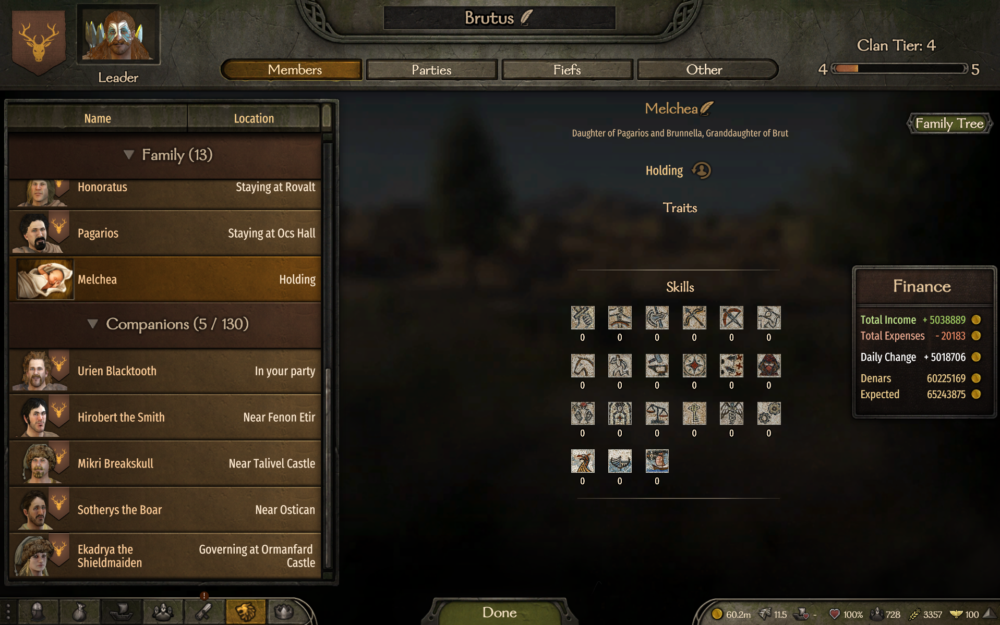
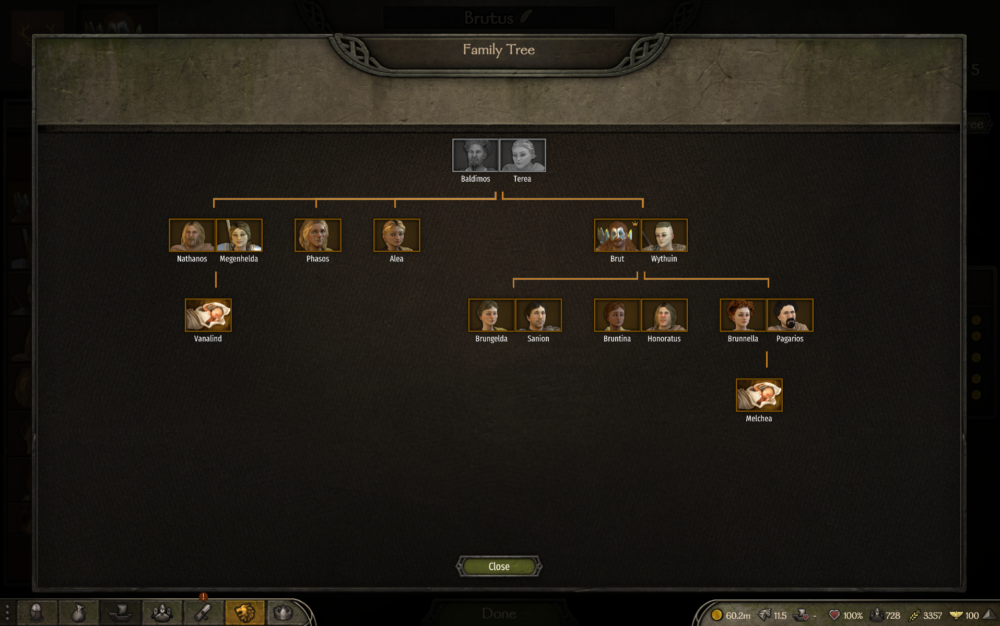

# Brut.FamilyTree

A Mount & Blade II: Bannerlord mod that enhances family relationship display in the Clan Screen.

## Screenshots

### Clan Screen

### Family Tree

## Features

### Enhanced Relation Display
Shows detailed family lineage instead of simple labels in the Clan Screen (L key):

| Before | After |
|--------|-------|
| Nephew | Son of Nathanos and Megenhelda, nephew of Brut |
| Niece | Daughter of Nathanos and Megenhelda, niece of Brut |
| Sister-in-law | Wife of Nathanos, sister-in-law of Brut |
| Brother-in-law | Husband of Liena, brother-in-law of Brut |

### Family Tree Popup
Visual family tree display accessible from the Clan Screen.

### Localization
Full support for English and Russian languages.

## Scope

The enhanced relation display is **only active in the Clan Screen** (opened with L key). Other game screens like Encyclopedia, dialogs, and tooltips use the original game behavior.

## Requirements

- Mount & Blade II: Bannerlord (tested on v1.2.x)
- [Bannerlord.Harmony](https://www.nexusmods.com/mountandblade2bannerlord/mods/2006) v2.3.0+

## Installation

1. Download the mod
2. Extract to `Mount & Blade II Bannerlord/Modules/Brut.FamilyTree`
3. Enable "Brut.FamilyTree" in the launcher

## Changelog

### v1.0.0
- Fixed nephew/niece relation display (now shows parents info)
- Fixed sister-in-law/brother-in-law relation display
- Limited enhanced relations to Clan Screen only (no more interference with Encyclopedia)
- Added Russian localization for new relation types

### v0.2.0
- Added Family Tree popup visualization
- Localized UI text

### v0.1.0
- Initial release with Family Tree button

## Technical Details

The mod uses Harmony to patch `ConversationHelper.GetHeroRelationToHeroTextShort`. The patch:
- Only activates when `GauntletClanScreen` is the top screen
- Disables when Encyclopedia is open (even over Clan Screen)
- Uses BFS to find relation paths between heroes
- Formats output to work with game's automatic "of {Name}" suffix

## License

MIT
